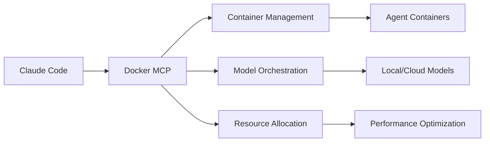

# Docker Desktop 4.42.2 MCP Toolkit & AI Models

## Overview

Docker Desktop 4.42.2 introduces exciting new capabilities with MCP (Model Context Protocol) toolkit and integrated AI models. This opens up powerful possibilities for our containerized Claude Code platform.

## New Features Available

### 1. MCP Toolkit Integration
Docker Desktop now includes native MCP support, which could provide:
- Built-in MCP server capabilities
- Docker container management via MCP
- Direct integration with containerized applications
- Native debugging and monitoring tools

### 2. AI Models Integration
The new version includes AI model support directly in Docker Desktop:
- Local model hosting capabilities
- Model management interface
- Resource allocation for AI workloads
- Performance monitoring for AI tasks

## Potential Enhancements for Our Platform

### 1. Native MCP Server in Docker
```yaml
# Potential docker-compose enhancement
services:
  mcp-server:
    image: docker/mcp-server:latest  # If available
    ports:
      - "3100:3100"
    environment:
      - MCP_MODE=docker
      - ENABLE_CONTAINER_TOOLS=true
```

### 2. AI Model Management
- Host local models alongside Claude API
- Fallback to local models when API limits reached
- Specialized models for different tasks:
  - Code generation
  - Documentation
  - Testing
  - Security scanning

### 3. Enhanced Container Capabilities
- **Container MCP Tools**: Create, manage, inspect containers via MCP
- **Volume Management**: Direct file operations through MCP
- **Network Control**: Configure container networking
- **Resource Monitoring**: Real-time CPU/Memory/GPU usage

### 4. Development Workflow Improvements


## Integration Ideas

### 1. MCP Server for Container Management
Create an MCP server that provides tools for:
- `docker_create_container`
- `docker_exec_command`
- `docker_copy_files`
- `docker_inspect`
- `docker_logs`

### 2. Model Router
Implement intelligent routing between:
- Claude API (primary)
- Local LLMs (fallback/specialized)
- Docker AI models (specific tasks)

### 3. Resource Optimization
Use Docker's AI features to:
- Monitor token usage across agents
- Allocate GPU resources dynamically
- Cache model responses
- Optimize container resource limits

## Implementation Approach

### Phase 1: Explore Docker MCP Features
```bash
# Check available MCP features
docker mcp --help  # If available

# List AI models
docker ai models list  # If available

# Inspect MCP capabilities
docker info | grep -i mcp
```

### Phase 2: Create MCP Integration
```javascript
// Example MCP server for Docker operations
const DockerMCPServer = {
  tools: {
    container_create: async (params) => {
      // Create container via Docker API
    },
    container_exec: async (params) => {
      // Execute commands in container
    },
    model_invoke: async (params) => {
      // Invoke AI model
    }
  }
};
```

### Phase 3: Enhance Our Platform
1. Add Docker MCP tools to Claude Code
2. Enable model selection based on task
3. Implement resource monitoring
4. Create unified orchestration layer

## Benefits for Claude Swarm Platform

1. **Reduced Latency**: Local model execution for simple tasks
2. **Cost Optimization**: Use appropriate models for each task
3. **Better Integration**: Native Docker tools via MCP
4. **Enhanced Monitoring**: Built-in AI performance metrics
5. **Scalability**: Leverage Docker's container orchestration

## Next Steps

1. **Research**: Investigate exact MCP features in Docker Desktop 4.42.2
2. **Test**: Try Docker MCP commands and AI model features
3. **Design**: Plan integration with our orchestration platform
4. **Implement**: Add Docker MCP tools to our containers
5. **Optimize**: Use AI models for appropriate tasks

## Questions to Explore

1. What MCP servers are included in Docker Desktop?
2. Which AI models are available?
3. How do we access Docker MCP from containers?
4. Can we create custom MCP servers for Docker?
5. What are the resource requirements?

This integration could significantly enhance our platform's capabilities, providing native container management through MCP and intelligent model selection for different agent tasks.