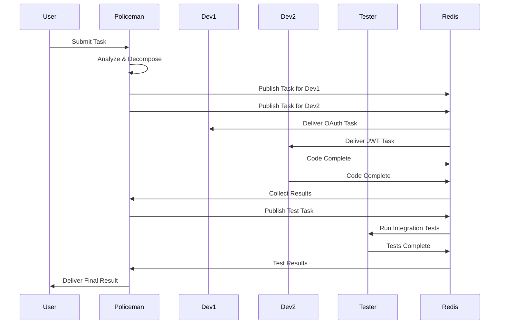

# Orchestration Hierarchy

## The Policeman: Central Orchestrator

```
                    ┌─────────────────────┐
                    │    POLICEMAN        │
                    │  (Main Orchestrator) │
                    │                     │
                    │ Responsibilities:   │
                    │ • Task Distribution │
                    │ • Coordination      │
                    │ • Validation        │
                    │ • Result Aggregation│
                    └──────────┬──────────┘
                               │
                               │ Commands & Controls
         ┌─────────────────────┼─────────────────────┐
         │                     │                     │
         ▼                     ▼                     ▼
┌─────────────────┐  ┌─────────────────┐  ┌─────────────────┐
│  DEVELOPER-1    │  │  DEVELOPER-2    │  │    TESTER       │
│  (Worker Agent) │  │  (Worker Agent) │  │  (QA Agent)     │
│                 │  │                 │  │                 │
│ • Code Writing  │  │ • Code Writing  │  │ • Run Tests     │
│ • Implementation│  │ • Implementation│  │ • Validation    │
│ • Parallel Work │  │ • Parallel Work │  │ • Quality Check │
└─────────────────┘  └─────────────────┘  └─────────────────┘
```

## Why "Policeman"?

The name reflects its role:
- **Enforces Rules**: Validates code through hooks before allowing commits
- **Maintains Order**: Coordinates multiple agents to prevent conflicts
- **Quality Control**: Ensures all code passes validation before proceeding
- **Traffic Director**: Routes tasks to appropriate agents

## Orchestration Flow

### 1. Task Reception
```python
# Policeman receives a task
task = {
    "type": "feature_development",
    "description": "Create user authentication system",
    "requirements": ["OAuth", "JWT tokens", "2FA support"]
}
```

### 2. Task Analysis & Distribution
```python
# Policeman analyzes and breaks down the task
subtasks = policeman.analyze_task(task)
# Results in:
# - Subtask 1: OAuth implementation → Developer-1
# - Subtask 2: JWT token system → Developer-2
# - Subtask 3: Integration testing → Tester
```

### 3. Coordination


## Key Orchestrator Features

### 1. **Task Queue Management**
- Maintains priority queue of tasks
- Distributes based on agent availability
- Handles task dependencies

### 2. **Agent Health Monitoring**
```python
# Policeman monitors agent health
agents = {
    "developer-1": {"status": "active", "load": 0.7},
    "developer-2": {"status": "active", "load": 0.3},
    "tester": {"status": "idle", "load": 0.0}
}
```

### 3. **Validation Enforcement**
- Runs hooks before accepting code
- Validates syntax, style, security
- Rejects invalid submissions

### 4. **Result Aggregation**
- Collects outputs from all agents
- Combines into coherent result
- Handles merge conflicts

## Communication Channels

### Redis Pub/Sub Topics
```
/tasks/assign     - Policeman publishes new tasks
/tasks/claim      - Agents claim tasks
/status/update    - Agents report progress
/results/submit   - Agents submit completed work
/health/check     - Health monitoring
```

### PostgreSQL Tables
```sql
-- Task tracking
CREATE TABLE tasks (
    id SERIAL PRIMARY KEY,
    status VARCHAR(50),
    assigned_to VARCHAR(100),
    created_by VARCHAR(100),
    result TEXT
);

-- Agent status
CREATE TABLE agents (
    name VARCHAR(100) PRIMARY KEY,
    status VARCHAR(50),
    last_heartbeat TIMESTAMP,
    current_task_id INTEGER
);
```

## Scaling Considerations

### Current Setup (Centralized)
```
         Policeman
         /   |   \
      Dev1  Dev2  Tester
```

### Future Setup (Hierarchical)
```
         Master Policeman
         /            \
    Regional         Regional
    Policeman-1      Policeman-2
    /    |    \      /    |    \
  Dev1  Dev2  Dev3  Dev4  Dev5  Dev6
```

## Access the Orchestrator

```bash
# SSH into Policeman container
docker exec -it claude-policeman /bin/bash

# View orchestrator logs
docker logs -f claude-policeman

# Check orchestrator status
curl http://localhost:8080/status

# Monitor Redis messages
docker exec -it claude-redis redis-cli
> SUBSCRIBE /tasks/*
```

## Configuration

The Policeman's behavior is controlled by environment variables:
```yaml
environment:
  - AGENT_ROLE=policeman
  - MAX_CONCURRENT_TASKS=10
  - TASK_TIMEOUT=300
  - VALIDATION_STRICT=true
```

## Summary

The **Policeman is the brain** of the operation:
- Receives all tasks from users
- Breaks them down into smaller pieces
- Assigns work to appropriate agents
- Monitors progress
- Validates results
- Returns combined output

Without the Policeman, the other agents would just be isolated workers with no coordination!