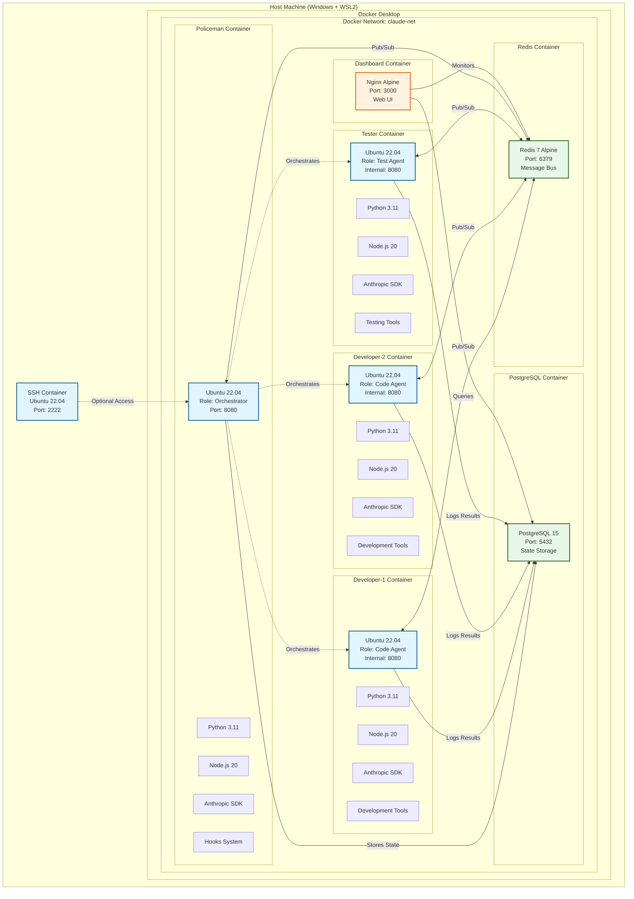
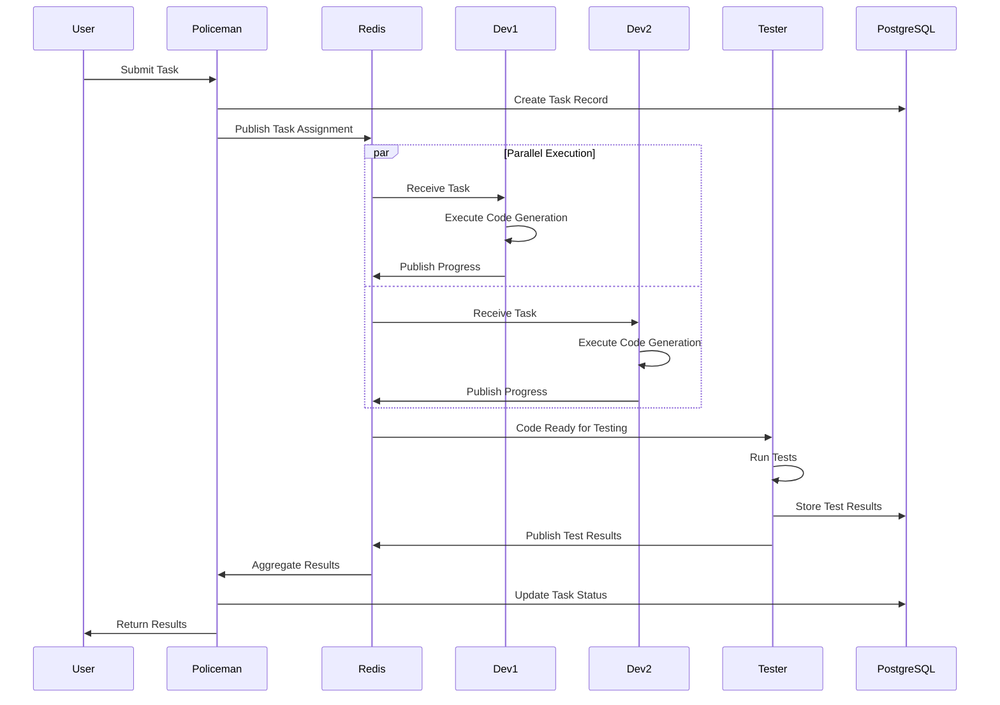
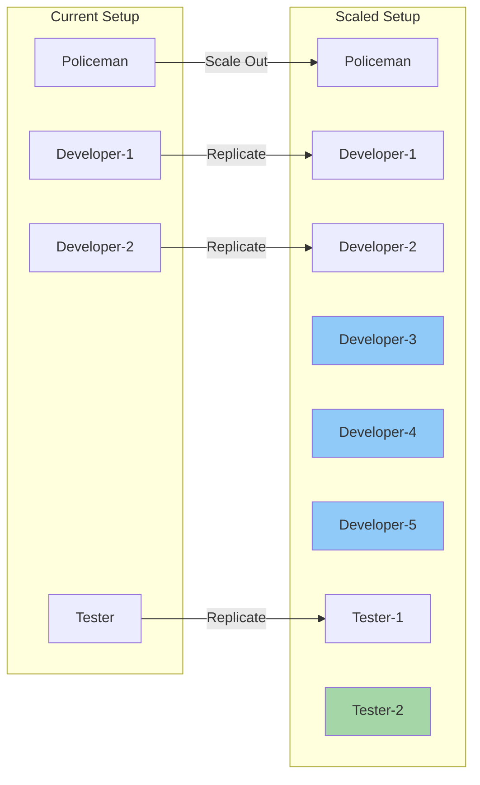

# Claude Swarm Docker Platform - System Architecture

## Overview
Yes, each developer (1, 2, 3) runs in its **own separate Ubuntu 22.04 container**. Each container is completely isolated with its own:
- File system
- Process space
- Network interface
- Memory allocation
- CPU allocation

## System Architecture Diagram



## Container Details

### 1. **Policeman Container** (Orchestrator)
- **OS**: Ubuntu 22.04
- **Role**: Central coordinator, task distribution, validation
- **Exposed Port**: 8080 (Web UI)
- **Resources**: 2 CPU cores, 2GB RAM
- **Special Features**: Hook validation system

### 2. **Developer-1 Container**
- **OS**: Ubuntu 22.04
- **Role**: Primary development agent
- **Internal Port**: 8080 (not exposed)
- **Resources**: 2 CPU cores, 2GB RAM
- **Workspace**: `/workspace/projects`

### 3. **Developer-2 Container**
- **OS**: Ubuntu 22.04
- **Role**: Secondary development agent
- **Internal Port**: 8080 (not exposed)
- **Resources**: 2 CPU cores, 2GB RAM
- **Workspace**: `/workspace/projects`

### 4. **Tester Container**
- **OS**: Ubuntu 22.04
- **Role**: Testing and validation
- **Internal Port**: 8080 (not exposed)
- **Resources**: 1 CPU core, 1GB RAM
- **Workspace**: `/workspace/projects`

## Communication Flow



## Resource Isolation

Each container has:
- **Isolated File System**: Each container has its own root filesystem
- **Process Isolation**: Processes in one container cannot see processes in another
- **Network Isolation**: Each container has its own network namespace
- **Resource Limits**: CPU and memory limits enforced by Docker

## Shared Resources

### Volumes (Persistent Storage)
```yaml
volumes:
  - ./projects:/workspace/projects      # Shared project files
  - ./hooks:/workspace/hooks:ro         # Read-only hooks
  - policeman-claude:/home/developer/.claude  # Isolated Claude config
```

### Network
- All containers on same Docker network (`claude-net`)
- Can communicate using container names as hostnames
- Example: Dev1 can reach Redis at `claude-redis:6379`

## Scaling Model



## Container Management Commands

```bash
# View all containers
docker ps -a

# Access specific container
docker exec -it claude-developer-1 /bin/bash
docker exec -it claude-developer-2 /bin/bash
docker exec -it claude-tester /bin/bash

# View resource usage
docker stats

# Scale up (add more developers)
docker compose -f docker-compose.enhanced.yml up -d --scale developer=5

# View logs from specific container
docker logs -f claude-developer-1
```

## Security & Isolation

1. **Container Isolation**: Each container runs in its own namespace
2. **User Isolation**: Running as non-root user (`developer`)
3. **Network Security**: Internal network not exposed to host
4. **Resource Limits**: Prevents one container from consuming all resources

## Summary

- **Yes**, each developer runs in its own Ubuntu 22.04 container
- Containers are **completely isolated** from each other
- They communicate through **Redis** (pub/sub) and **PostgreSQL** (shared state)
- The **Policeman** orchestrates all agents
- You can SSH into any container or use `docker exec`
- Easy to scale by adding more containers